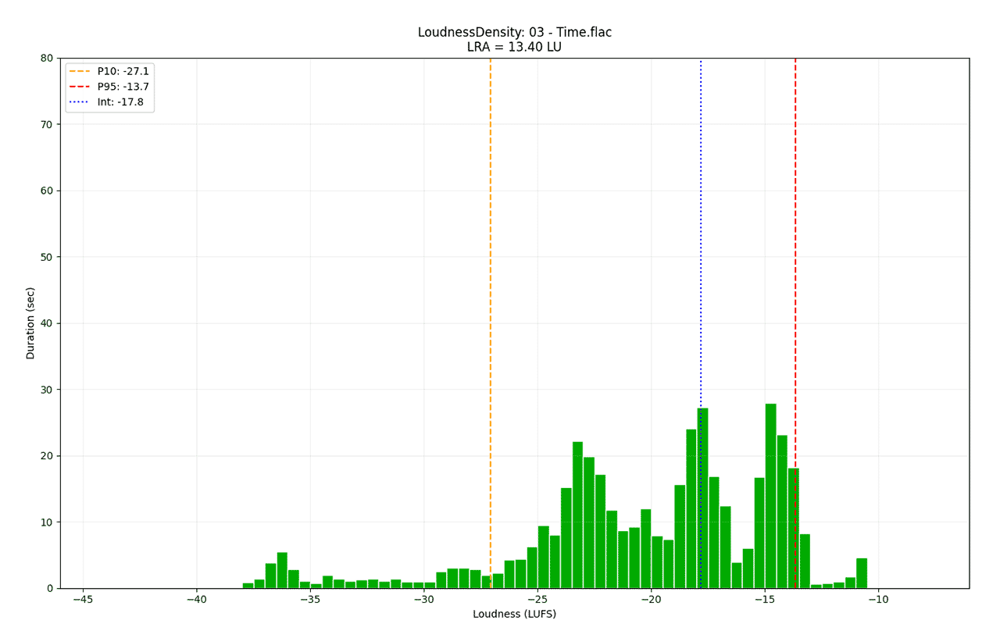
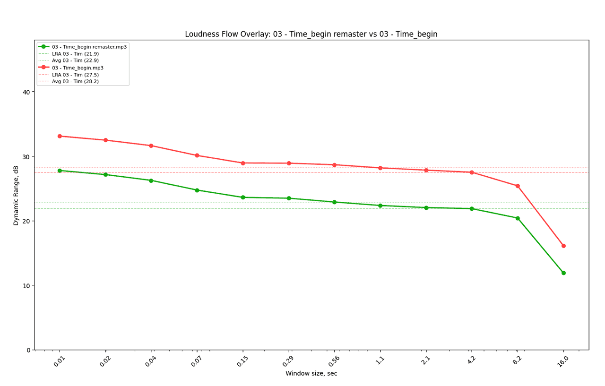

# Loudness Flow Measure (LFM) v0.8.2

Audio loudness analysis tool compliant with **ITU-R BS.1770-4** and **EBU 3342** standards. Calculates integrated loudness (LUFS), loudness range (LRA), and multi-window dynamics analysis (Loudness Flow). Generates visual reports as PNG images.

**[English](README.md)** | [Русский](README.ru.md)

## Preview

| Loudness Density Histogram | Loudness Flow Overlay      |
|----------------------------|----------------------------|
| [](media/ds_preview.png) | [](media/fl_overlay_previw.png) |

## Features

- **Integrated LUFS** — integrated loudness per BS.1770-4 (double gating)
- **LRA** — loudness range per EBU 3342 (P10 / P95)
- **True Peak** — inter-sample peak detection with 2× oversampling
- **Digital Peak** — maximum sample level without oversampling
- **Loudness Flow** — dynamics analysis across multiple time windows (0.01–16 sec, logarithmic steps)
- **Top-3 Dominants** — three most common loudness levels by duration
- **Delta Comparison** — automatic comparison of tracks with similar names
- **Overlay Flow** — when processing exactly 2 files, a third graph is generated with both Loudness Flow curves on a single axis for visual comparison
- **Visualization** — charts:
  - `ds <name>.png` — loudness density distribution
  - `fl <name>.png` — Loudness Flow chart
  - `fl <name1>_vs_<name2>.png` — overlay comparison of two tracks

## Requirements

- Python 3.8+
- Libraries: `pydub`, `numpy`, `scipy`, `matplotlib`
- `ffmpeg.exe` and `ffprobe.exe` in the `ffmpeg/` folder

## Installation

```bash
pip install pydub numpy scipy matplotlib
```

Ensure the project folder contains:
```
ffmpeg/
├── ffmpeg.exe
└── ffprobe.exe
```

## Usage

```bash
python lfm.py <path_to_file_or_folder> --verbose (-v)
```

Without arguments, processes all `.wav`, `.mp3`, `.flac` files in the current directory.

## Configuration (`lfm.ini`)

The `lfm.ini` file provides extensive settings for computation and display:

- **[Main]** — mode (`LUFS`/`RMS`), verbose, `delta_comparison` (name-based comparison) and `overlay_flow` (overlay for 2 files) options
- **[LoudnessDensity]** — X-axis range, bar count, histogram colors
- **[LoudnessFlow]** — analysis windows, peak trimming, Y-axis scale, line color

## Output

After processing, the following files are generated:
- `loudness_flow_report.txt` — text report
- `ds <name>.png` — density chart
- `fl <name>.png` — Loudness Flow chart
- `fl <name1>_vs_<name2>.png` — overlay comparison (for 2 files, if enabled)

### Console Output Example

```
Loudness Flow Measure v0.8.2

> [1/2] Processing: 01-the_simpsons_theme_(orchestral_version).mp3
  P10:        -18.45 LUFS
  Integrated: -14.32 LUFS
  P95:         -9.87 LUFS
  LRA:          8.58 LU
  True Peak:   -0.42 dBTP
  Dig. Peak:   -0.58 dBTP
  Flow Avg:    12.34 dB
TOP-3 Dominants:
  Level   -14.50 LUFS: 45.20 sec
  Level   -10.25 LUFS: 32.10 sec
  Level   -19.75 LUFS: 18.60 sec
[DELTA COMPARISON] with Time_remaster.mp3:
  dInt:   -2.82 LU
  dLRA:   +5.56 LU
  dFlow:  +5.37 dB
  dDPeak: +0.00 dB
```

## Algorithm

1. **Loading** — decoding via pydub, normalization to float32
2. **K-filtering** — Pre-filter (High Shelf 1500 Hz) + RLB (High Pass 38.1 Hz)
3. **True Peak + Digital Peak** — 2× oversampling + max detection across all channels
4. **Integrated LUFS** — momentary power calculation (400 ms, 100 ms step), double gating
5. **LRA** — 3 sec window calculation, P10/P95 with gating
6. **Loudness Flow** — geometric window series, range calculation (P95–P10)
7. **Visualization** — PNG export with settings from `lfm.ini`

## Known Issues

- Only mono and stereo supported (>2 channels not processed)

## License

This project is licensed under the **GNU General Public License v3.0** — see the [GPL-3.0 License](https://www.gnu.org/licenses/gpl-3.0.html) for details.
